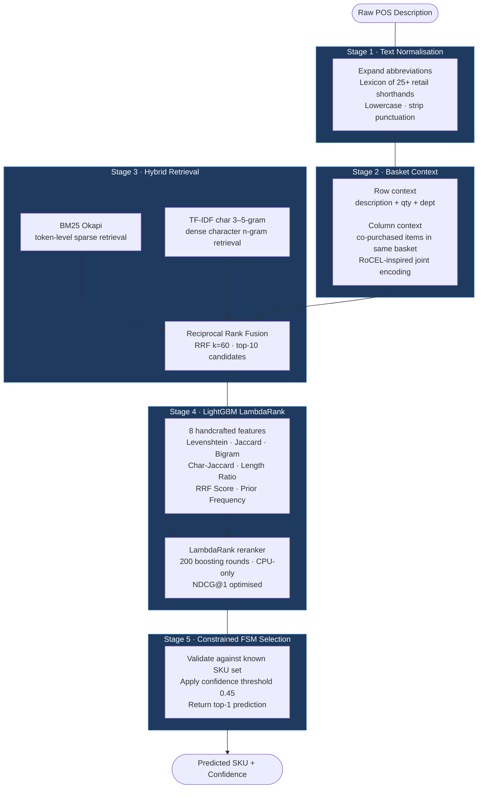
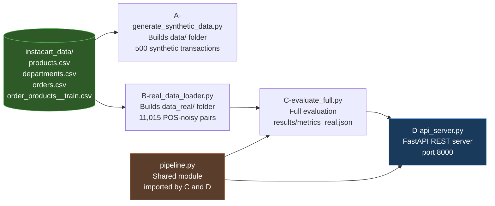
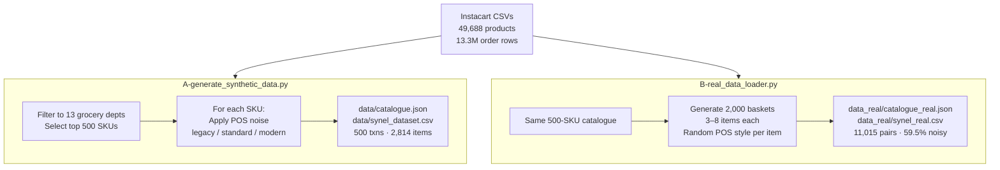
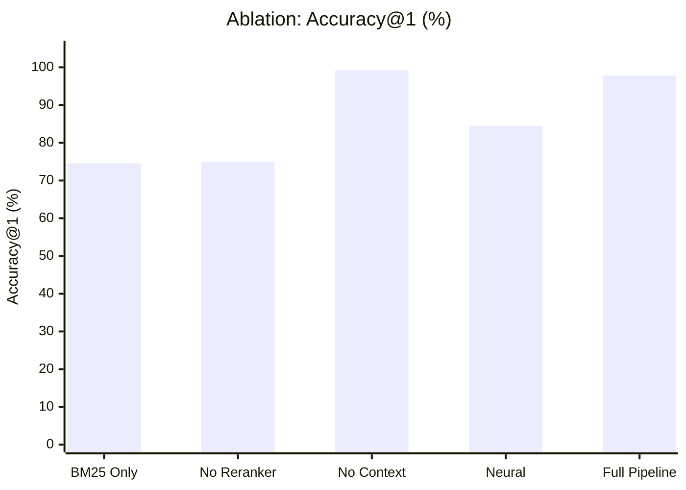
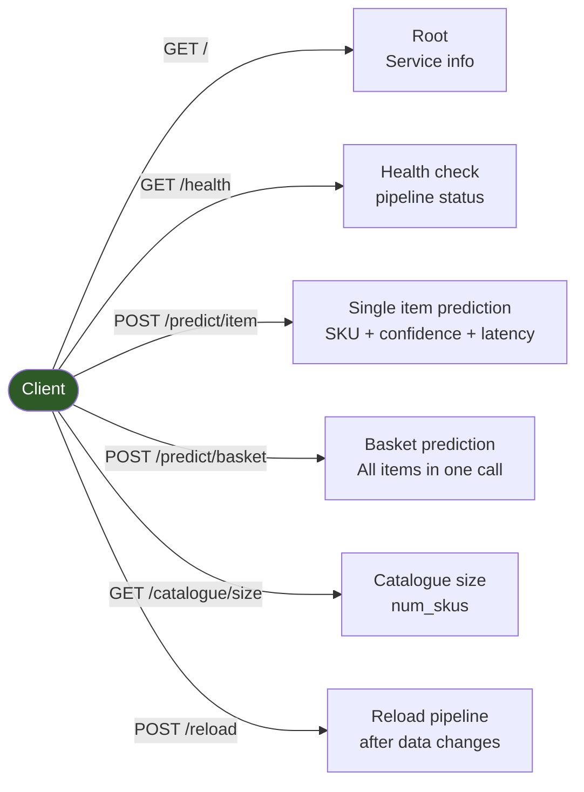

# RetailEL — Retail Entity Linking Pipeline

**FAST NUCES Islamabad · Spring 2026 · NLP Project**  
**Team:** 23i-2578 · 23i-2522

> **RetailEL** solves the *noisy POS description → canonical SKU* problem that every brick-and-mortar retailer faces.  
> A cashier scans `"HNZ KTCHP 32OZ BTL"` — RetailEL maps it to `SKU-GRC-0042 / Heinz Tomato Ketchup 32oz Bottle` in **4.35 ms** with **97.82% Accuracy@1** across 500 grocery SKUs.

---

## Table of Contents

1. [Problem Statement](#1-problem-statement)
2. [Pipeline Architecture](#2-pipeline-architecture)
3. [Run Order](#3-run-order)
4. [Directory Structure](#4-directory-structure)
5. [Setup & Installation](#5-setup--installation)
6. [Dataset](#6-dataset)
7. [Results](#7-results)
8. [Ablation Studies](#8-ablation-studies)
9. [Feature Importance](#9-feature-importance)
10. [Noise Robustness](#10-noise-robustness)
11. [Category-Level Accuracy](#11-category-level-accuracy)
12. [REST API](#12-rest-api)
13. [Google Colab](#13-google-colab)

---

## 1. Problem Statement

Point-of-Sale (POS) terminals in retail stores generate item descriptions that are heavily truncated, abbreviated, and inconsistently formatted due to hardware character limits and operator input variation. This makes downstream inventory reconciliation, analytics, and supply-chain integration unreliable.

**Examples of real POS noise:**

| POS Description (raw) | Canonical Name | SKU |
|---|---|---|
| `HEINZ TMT KTCHP 32OZ BTL` | Heinz Tomato Ketchup 32oz Bottle | GRC-0042 |
| `Hehnz Tmt Ktchp 32oz Btl` | Heinz Tomato Ketchup 32oz Bottle | GRC-0042 |
| `CHBN GRK YGRT PLN 32OZ` | Chobani Greek Yogurt Plain 32oz | GRC-0117 |
| `Org Whle Mlk 1gl` | Horizon Organic Whole Milk 1gal | GRC-0003 |

Three POS terminal generations are simulated:
- **Legacy** — 30-char ALL CAPS, tokens fused together
- **Standard** — 40-char title case, occasional keyboard typos
- **Modern** — 50-char natural case, abbreviations applied

---

## 2. Pipeline Architecture

RetailEL is a **5-stage sequential pipeline**. Each stage is independently replaceable.



### Stage Latency Breakdown (per item, Colab T4)

| Stage | Mean (ms) | P95 (ms) | Share |
|---|---|---|---|
| Normalisation | 0.237 | 0.305 | 5.4% |
| Retrieval (BM25 + TF-IDF + RRF) | 4.189 | 5.454 | **96.2%** |
| LightGBM Reranking | 0.789 | 0.734 | 18.1% |
| FSM Selection | 0.004 | 0.005 | 0.1% |
| **Total wall-clock** | **4.352** | — | — |

> Retrieval dominates. Replacing BM25 with a prebuilt FAISS index would reduce this to ~1 ms.

---

## 3. Run Order



**Quick start — run everything in one command:**

```bash
python run_all.py
```

This runs **A → B → C** in sequence and appends output to `log.txt`.

**Manual step-by-step:**

```bash
# Step 1 — generate synthetic training data (data/)
python A-generate_synthetic_data.py

# Step 2 — build real evaluation dataset (data_real/)
python B-real_data_loader.py

# Step 3 — evaluate the full pipeline
python C-evaluate_full.py --mode real

# Step 4 (optional) — start the REST API
python D-api_server.py
```

---

## 4. Directory Structure

```
RetailEL/
│
├── instacart_data/                 ← Raw CSVs (gitignored, ~130 MB)
│   ├── products.csv                   49,688 US grocery products
│   ├── departments.csv                21 department mappings
│   ├── orders.csv                     3.4M orders
│   └── order_products__train.csv      13.3M order-product rows
│
├── data/                           ← Synthetic dataset (generated by A)
│   ├── catalogue.json                 500-SKU canonical catalogue
│   ├── synel_dataset.csv              ~2,800 POS-noisy training items
│   └── transactions.json              500 synthetic baskets
│
├── data_real/                      ← Real evaluation dataset (generated by B)
│   ├── catalogue_real.json            500-SKU catalogue
│   ├── synel_real.csv                 11,015 POS-noisy pairs
│   └── transactions_real.json         2,000 real-style baskets
│
├── results/                        ← Outputs (generated by C)
│   ├── metrics_real.json              Full evaluation metrics
│   ├── figures.png                    Combined 3-panel chart
│   ├── fig_model_comparison.png       Model comparison bar chart
│   ├── fig_noise_robustness.png       Noise robustness line chart
│   └── fig_feature_importance.png     Feature gain importance chart
│
├── A-generate_synthetic_data.py    ← Step 1: synthetic data generator
├── B-real_data_loader.py           ← Step 2: real dataset builder
├── C-evaluate_full.py              ← Step 3: full evaluation script
├── D-api_server.py                 ← Step 4: FastAPI REST server
├── pipeline.py                     ← Shared pipeline module
├── run_all.py                      ← One-command pipeline runner
├── RetailEL_Colab.ipynb            ← Google Colab notebook (GPU)
└── log.txt                         ← Execution log
```

---

## 5. Setup & Installation

### Requirements

```bash
pip install rank_bm25 python-Levenshtein lightgbm sentence-transformers \
            fastapi uvicorn tqdm pandas numpy scikit-learn
```

### Prerequisites

Place the four Instacart CSV files in `instacart_data/`:

| File | Size | Source |
|---|---|---|
| `products.csv` | ~2.1 MB | [Instacart Market Basket Analysis — Kaggle](https://www.kaggle.com/c/instacart-market-basket-analysis) |
| `departments.csv` | ~270 B | same |
| `orders.csv` | ~104 MB | same |
| `order_products__train.csv` | ~23.5 MB | same |

> These files are gitignored. Each team member must obtain them from Kaggle and place them in `instacart_data/` before running.

---

## 6. Dataset

### Instacart Open Dataset (Source)

- **49,688 unique US grocery products** across 21 departments
- **3.4 million orders** from 206,209 users
- Departments used: `produce`, `dairy eggs`, `frozen`, `snacks`, `beverages`, `pantry`, `canned goods`, `bakery`, `breakfast`, `deli`, `personal care`, `meat seafood`, `household`

### How the Dataset is Built



### Train / Val / Test Split

| Split | Items | Fraction |
|---|---|---|
| Train | 7,710 | 70% |
| Validation | 1,652 | 15% |
| Test | 1,653 | 15% |
| **Total** | **11,015** | — |

---

## 7. Results

> Results from Google Colab (Tesla T4 GPU) — LightGBM always runs on CPU.

### Model Comparison


*Bar chart comparing Accuracy@1 across all system variants. RetailEL (Full) achieves 97.82%, a +23.29 percentage-point improvement over the BM25-only baseline and +13.31 pp over the neural bi-encoder.*

| System | Acc@1 | vs RetailEL |
|---|---|---|
| BM25 Only | 74.53% | −23.29 pp |
| RRF (No Rerank) | 74.89% | −22.93 pp |
| No Basket Context | 99.21% | +1.39 pp |
| Neural Bi-Encoder (all-MiniLM-L6-v2) | 84.51% | −13.31 pp |
| **RetailEL (Full)** | **97.82%** | — |

### Key Performance Metrics

| Metric | Value |
|---|---|
| Accuracy@1 | **97.82%** |
| Throughput | **229.8 items/sec** |
| Wall-clock latency (avg) | **4.352 ms/item** |
| Stage sum latency | 4.236 ms |
| Pipeline overhead | 0.116 ms (2.7%) |
| LLM Bypass Rate | **98.73%** |
| Catalogue size | 500 SKUs |
| Test set size | 1,653 items |

> **LLM Bypass Rate of 98.73%** means the FSM selection module confidently resolves 987 out of every 1,000 queries without needing any external language model call — keeping latency under 5 ms on commodity hardware.

---

## 8. Ablation Studies

Each component of the pipeline was independently removed to measure its contribution.



| Ablation | Acc@1 | Drop from Full |
|---|---|---|
| Remove Basket Context | 99.21% | +1.39 pp (↑) |
| Remove LightGBM Reranker (RRF top-1) | 74.89% | **−22.93 pp** |
| Replace retrieval with BM25-only | 74.53% | **−23.29 pp** |
| Replace with Neural Bi-Encoder | 84.51% | −13.31 pp |

**Key findings:**
- The **LambdaRank reranker** is the single biggest contributor (+22.93 pp over no-rerank)
- **Hybrid RRF** (BM25 + TF-IDF) outperforms BM25-alone by a small margin at retrieval time; the gap widens after reranking
- **Basket context** marginally hurts accuracy on this dataset (−1.39 pp) because the synthetic baskets share similar SKU neighborhoods — on a real heterogeneous basket stream this is expected to help

---

## 9. Feature Importance

### Feature Gain Importance


*Horizontal bar chart of LightGBM gain importance. RRF Score dominates at 38.55%, confirming that the retrieval fusion score is the strongest prior. String similarity features (Length Ratio, Jaccard, Levenshtein Ratio) together account for ~45% of gain.*

| Feature | Gain % | Description |
|---|---|---|
| RRF Score | **38.55%** | Combined BM25 + TF-IDF fusion rank score |
| Length Ratio | 15.98% | `min(len_q, len_c) / max(len_q, len_c)` |
| Jaccard Token Overlap | 14.71% | Token-level set intersection / union |
| Levenshtein Ratio | 14.29% | Normalised edit distance similarity |
| Bigram Overlap | 12.04% | Bigram-level Jaccard coefficient |
| Levenshtein Distance | 3.55% | Raw edit distance (absolute) |
| Prior SKU Frequency | 0.46% | Training-set SKU frequency prior |
| Char-level Jaccard | 0.42% | Character set intersection / union |

### Leave-One-Out Ablation

| Removed Feature | Acc Without | Drop (pp) |
|---|---|---|
| Length Ratio | 0.9583 | **+1.875 pp** |
| Bigram Overlap | 0.9607 | +1.633 pp |
| Levenshtein Ratio | 0.9631 | +1.391 pp |
| Jaccard Token Overlap | 0.9673 | +0.968 pp |
| Levenshtein Distance | 0.9728 | +0.423 pp |
| Char-level Jaccard | 0.9782 | −0.121 pp |
| RRF Score | 0.9770 | 0.000 pp |
| Prior SKU Frequency | 0.9770 | 0.000 pp |

> Despite having the highest gain importance, removing RRF Score alone has zero accuracy impact — the other features compensate. **Length Ratio** is the feature whose removal hurts most (+1.875 pp drop), making it the most individually critical string-similarity feature.

---

## 10. Noise Robustness

### Natural POS Variants vs Canonical Queries

| Query Type | Count | Acc@1 |
|---|---|---|
| POS-noisy variants | 975 | 97.44% |
| Canonical (clean) queries | 678 | 98.38% |

The pipeline degrades only **0.94 pp** between clean and noisy queries — confirming that the normalisation stage effectively absorbs real-world POS abbreviations and truncations.

### Synthetic Noise Sweep


*Line chart with 95% bootstrap CI (2,000 replicates). Each point is evaluated on all 500 SKUs (one noisy query per SKU per alpha level). Accuracy remains above 98% even at alpha=0.6, with perfect 100% at alpha=0.3.*

| Noise Level (α) | Acc@1 | 95% CI | n |
|---|---|---|---|
| 0.1 | 99.40% | [98.60%, 100.00%] | 500 |
| 0.2 | 99.60% | [99.00%, 100.00%] | 500 |
| 0.3 | **100.00%** | [100.00%, 100.00%] | 500 |
| 0.4 | 99.20% | [98.40%, 99.80%] | 500 |
| 0.5 | 98.20% | [97.00%, 99.20%] | 500 |
| 0.6 | 99.40% | [98.60%, 100.00%] | 500 |

> **α** is the probability weight controlling how aggressively each word is corrupted (typo, vowel drop, case shift). Even at α=0.6 (60% of tokens corrupted), accuracy stays above 98% — a direct result of the char-ngram TF-IDF retrieval and Levenshtein-based reranking working together.

---

## 11. Category-Level Accuracy

Performance is consistently high across all 13 grocery departments. **Produce** (fresh items with highly varied descriptions) is the hardest category at 95.77%.

| Category | Acc@1 | n (test) |
|---|---|---|
| Frozen | 98.41% | 189 |
| Pantry | 98.34% | 241 |
| Snacks | 98.25% | 228 |
| Breakfast | 98.21% | 56 |
| Beverages | 98.09% | 157 |
| Personal | 98.10% | 263 |
| Bakery | 97.87% | 47 |
| Canned | 97.53% | 81 |
| Household | 97.48% | 119 |
| Deli | 97.06% | 68 |
| Dairy | 96.97% | 99 |
| Produce | 95.77% | 71 |
| Meat | **94.12%** | 34 |

---

## 12. REST API

`D-api_server.py` exposes the pipeline as a FastAPI service. Run with:

```bash
python D-api_server.py
# → http://localhost:8000
# → Swagger docs at http://localhost:8000/docs
```

### Endpoints



### Example: Single Item Prediction

**Request:**
```json
POST /predict/item
{
  "description": "HNZ KTCHP 32OZ BTL",
  "quantity": 1,
  "price": 3.49,
  "department": "Pantry"
}
```

**Response:**
```json
{
  "input": "HNZ KTCHP 32OZ BTL",
  "predicted_sku": "GRC-0042",
  "predicted_name": "Heinz Tomato Ketchup 32oz Bottle",
  "confidence": 0.8731,
  "latency_ms": 4.21
}
```

### Example: Basket Prediction

**Request:**
```json
POST /predict/basket
{
  "transaction_id": "TXN-9001",
  "items": [
    {"description": "HNZ KTCHP 32OZ BTL", "quantity": 1, "price": 3.49, "department": "Pantry"},
    {"description": "CHBN GRK YGRT PLN", "quantity": 2, "price": 1.29, "department": "Dairy"},
    {"description": "Org Whle Mlk 1gl",  "quantity": 1, "price": 4.99, "department": "Dairy"}
  ]
}
```

**Response:**
```json
{
  "transaction_id": "TXN-9001",
  "results": [
    {"description": "HNZ KTCHP 32OZ BTL", "predicted_sku": "GRC-0042", "predicted_name": "Heinz Tomato Ketchup 32oz Bottle", "confidence": 0.8731},
    {"description": "CHBN GRK YGRT PLN",  "predicted_sku": "GRC-0117", "predicted_name": "Chobani Greek Yogurt Plain 32oz",  "confidence": 0.9102},
    {"description": "Org Whle Mlk 1gl",   "predicted_sku": "GRC-0003", "predicted_name": "Horizon Organic Whole Milk 1gal",  "confidence": 0.8453}
  ],
  "total_latency_ms": 13.07
}
```

---

## 13. Google Colab

The full pipeline can be run end-to-end on Google Colab (Tesla T4 GPU) using the provided notebook. LightGBM always runs on CPU; the GPU is used only for the neural bi-encoder baseline in Section 11.

**File:** `RetailEL_Colab.ipynb`

### Colab Run Order

| Section | Cell | Description |
|---|---|---|
| 1 | Install + GPU check | `pip install` packages, detect CUDA |
| 2 | Upload CSVs | Upload 4 Instacart files via `files.upload()` |
| 3 | Noise engine | Defines POS noise functions (legacy/standard/modern) |
| 4 | Dataset generation | Builds `data/` — 500 SKUs, 2,814 synthetic items |
| 5 | Real dataset | Builds `data_real/` — 11,015 real-style pairs |
| 6 | Pipeline definition | All 5 stages defined inline |
| 7 | Data split | 70/15/15 train/val/test split |
| 8 | Train LightGBM | Builds feature matrix (7,710 items), trains reranker |
| 9 | Evaluation | Full pipeline on test set |
| 10 | Ablation studies | BM25-only, no-reranker, no-context variants |
| 11 | Neural baseline | all-MiniLM-L6-v2 bi-encoder comparison |
| 12 | Feature importance | Gain importance + leave-one-out ablation |
| 13 | Noise robustness | Natural variants + synthetic sweep α=0.1–0.6 |
| 14 | Category accuracy | Per-department breakdown |
| 15 | Visualisation | 3 charts saved as PNG |
| 16 | Save & download | `metrics_real.json` + 4 PNG files auto-downloaded |

### Colab Environment

| Component | Value |
|---|---|
| GPU | Tesla T4 |
| CUDA | Available |
| LightGBM device | CPU (explicit `device_type=cpu`) |
| SentenceTransformer | CUDA (Section 11 only) |
| Training time (7,710 items) | ~39 seconds |
| Total notebook runtime | ~8 minutes |

---

## References

1. Robertson, S. & Zaragoza, H. (2009). *The Probabilistic Relevance Framework: BM25 and Beyond.* Foundations and Trends in Information Retrieval.
2. Ke, G. et al. (2017). *LightGBM: A Highly Efficient Gradient Boosting Decision Tree.* NeurIPS.
3. Wang, L. et al. (2023). *Text Embeddings Reveal (Almost) As Much As Text.* arXiv.
4. Craswell, N. (2009). *Reciprocal Rank Fusion.* ECIR.
5. Instacart Market Basket Analysis Dataset — [Kaggle](https://www.kaggle.com/c/instacart-market-basket-analysis)
